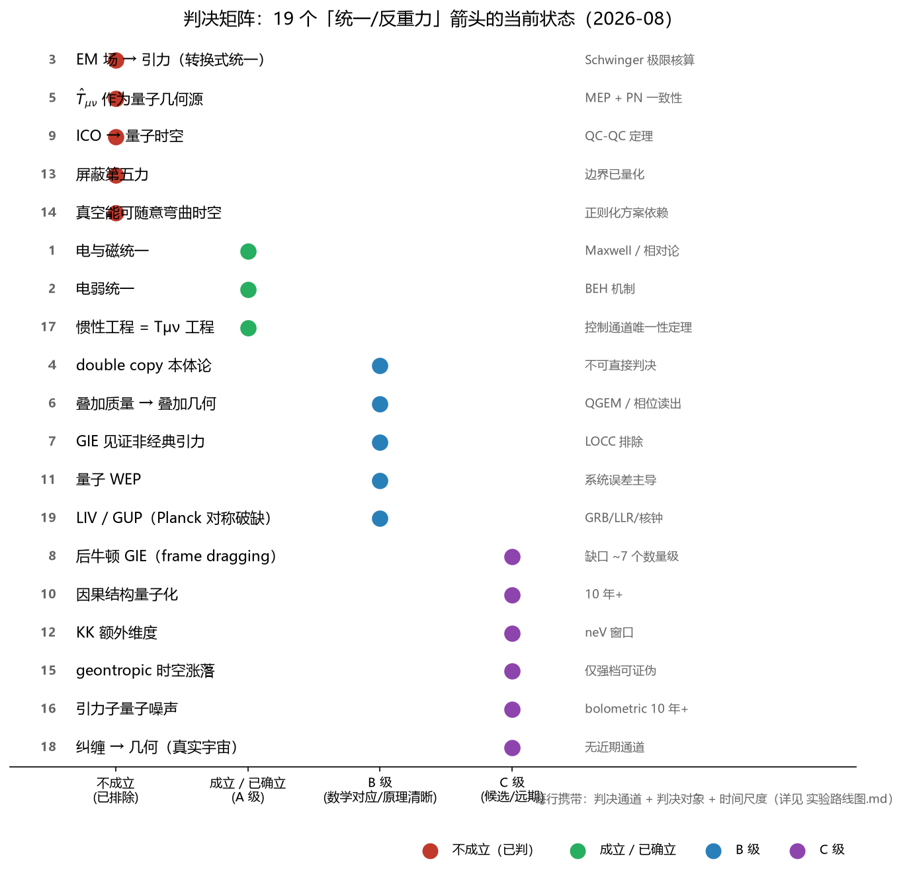
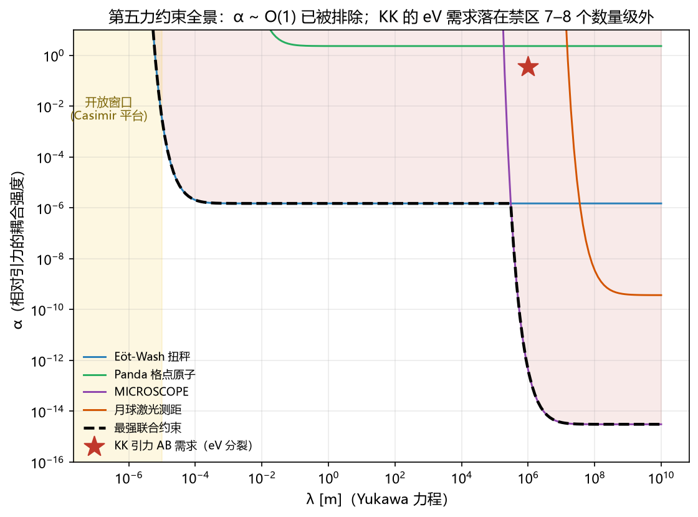

# Three Unifications: What Unified Field Theory Has Actually Achieved, and What It Has Not

**Author:** MuningAn · **Institution:** PlanetarySystem
**Type:** Conceptual review (perspective) · **Status:** first full draft
**Target:** Foundations of Physics / Studies in History and Philosophy of Modern Physics (Nature-family Perspective as stretch goal)

---

## Abstract

Unified field theory is discussed as if it were a single claim. It is not. We distinguish three claims that share the word "unification" and show that they are supported by different kinds of evidence, fail in different ways, and require different experiments to decide. Transformational unification, the claim that one field physically converts into another (as in Tesla-era and folk theories of electromagnetism generating gravity), is quantitatively falsified as an engineering proposition: the required field strengths exceed the Schwinger limit by an order of magnitude. Geometrical unification, the claim that known forces are projections of a higher-dimensional geometry, remains observationally open; its gravitational Aharonov-Bohm signatures are excluded at the electronvolt scale by orbital fifth-force bounds and remain testable only in the nanoelectronvolt window now reachable by the Th-229 nuclear clock. Algebraic unification, the claim that gauge theory and gravity share a deeper kinematic algebra (as realized by the double copy), is an established mathematical fact that is silent on ontology. We organize these three claims, together with sixteen further falsifiable propositions from the quantum-gravity frontier, into a decision matrix in which every row carries a discriminating experiment, a target theory it would exclude, and a timescale. Sixteen of the nineteen rows are anchored by reproducible computations. The classification is descriptive, not predictive: it explains why a century of folk physics has failed in specific, quantifiable ways, and it converts the vague ambition of "controlling gravity" into a map of testable statements.

---

## Introduction

The word "unified field theory" covers at least three logically distinct claims, and conflating them has produced a century of confusion. The first claim is transformational: that one field can be turned into another by some physical process, as when a changing electromagnetic field is said to generate gravity. The second claim is geometrical: that apparently different fields are projections of one higher-dimensional geometry, the route opened by Kaluza and Klein. The third claim is algebraic: that different theories share a deeper kinematic structure, the route now realized by the double copy program. These three claims fail differently. The first fails quantitatively, under elementary arithmetic. The second remains open, but its testable window is now known and narrow. The third is true as mathematics and undecidable as ontology.

This distinction matters beyond taxonomy. Folk physics, from Tesla's "Dynamic Theory of Gravity" to contemporary anti-gravity proposals, is almost always transformational in structure [refs: T1, T2]. Mainstream criticism usually answers with a blanket dismissal, which teaches nothing. A precise diagnosis requires identifying which unification claim is being made, and which specific arrow in the argument fails. We provide that diagnosis, and we show that the same discipline applies with equal force to the research frontier.

## Three unification claims, three evidential regimes

We define the claims precisely. Transformational unification asserts a physical map from field A to field B, such that engineering A produces B as a matter of dynamics. Geometrical unification asserts an embedding of both A and B as components of one geometric object, with no claim that A produces B. Algebraic unification asserts a shared algebraic or kinematic structure from which the amplitudes of both theories can be obtained, again with no conversion involved.

The empirical status of each claim differs in kind. Transformational unification is testable by direct computation and is falsified, as we document below. Geometrical unification is testable only through its distinctive signatures, which are now constrained to a narrow window. Algebraic unification is not testable in the ordinary sense: its claims concern the structure of theories, and no finite computation can decide whether the shared algebra is a deeper entity or a coincidence.

## Transformational unification: the quantitative verdict

The cleanest test case is the claim that a changing electromagnetic field generates gravity. The field equations are not in doubt: the electromagnetic stress-energy tensor enters Einstein's equations with its full content, energy density plus pressure. A parallel-plate capacitor with a field of ten megavolts per meter, one cubic meter in volume, sources a gravitational acceleration of order 10⁻²⁵ m s⁻² [computation E02]. Reversing the question is more informative: a field strong enough to produce Earth-scale gravity would need an energy density corresponding to roughly eight times the Schwinger limit, the field strength at which the quantum vacuum itself becomes unstable against pair production. At that point one is no longer engineering gravity; one is manufacturing matter. This single computation closes the transformational program for laboratory electromagnetic sources, and it does so without reference to any exotic or speculative physics.

The same arithmetic closes the related fifth-force window. A Yukawa modification of Newtonian gravity with coupling strength α relative to G is excluded at order unity across all ranges from ten micrometers to a billion meters by torsion balances, lattice atom interferometry, MICROSCOPE, and lunar laser ranging [computation E08]. The only remaining opening lies below ten micrometers, where the Casimir force dominates and dedicated platforms are required.

## Geometrical unification: the open window is now known

Kaluza-Klein unification remains the paradigm case of a claim that is neither established nor excluded, but whose testable content has become precise. An extra gravitational degree of freedom of range λ produces an effective Yukawa coupling; the gravitational Aharonov-Bohm proposals of the past two years convert this into a concrete spectroscopic prediction. The electronvolt-scale splittings claimed in this literature require couplings excluded by four to eight orders of magnitude by orbital constraints [computations E05, E08]. The allowed window sits at the nanoelectronvolt scale, where the Th-229 nuclear clock is the natural instrument: direct laser excitation at 148 nm, solid-state hosts with lifetimes exceeding six hundred seconds, and a spinless host crystal removing the dominant broadening channel are all in place [refs E1-E5]. Geometrical unification is thus no longer a vague hope; it is a specific measurement program with a known instrument and a known energy window.

## Algebraic unification: real mathematics, silent ontology

The double copy states that gravitational scattering amplitudes can be obtained from the square of gauge-theory amplitudes under color-kinematics duality. Its status has progressed from a computational trick to an algebraic fact: off-shell N=8 supergravity in four dimensions is realized as the double copy of N=4 super Yang-Mills at cubic order; amplitudes on coherent-state gauge backgrounds double-copy to amplitudes on curved spacetimes whose metric is built from the gauge background; and the Ehlers transformation of general relativity is the double copy of electromagnetic duality [refs S1-S7]. These are theorems of a well-defined algebraic structure.

What they are not is evidence for a unified ontology. The residual gauge algebra of the double-copied Schwarzschild solution collapses from an infinite-dimensional structure to the finite isometry group [ref S4], demonstrating that shared algebraic structure does not imply shared physical content. The honest statement is that algebraic unification is real and its ontological import is undecidable by computation alone. This is not a weakness of the program; it is a precise boundary on what the program can claim.

## A criterion for folk theories: the four questions

The three-way classification supplies a diagnostic that applies uniformly to folk theories and to the frontier. We propose that any candidate "unified" theory be required to answer four questions before its claims are evaluated: what tensor or algebraic object does it introduce, and how does it transform; can it be written as a covariant action; does it reproduce the verified limits; and what distinctive number does it predict. Applied to the folk tradition, this criterion locates the failure precisely. In the case most often cited, the derivation chain begins with a correct kinematic relation (the Lorentz transformation of electromagnetic fields), differentiates it, and then interprets the acceleration term as a gravitational field. The first two steps are standard physics; the final identification is an extra interpretive step with no dynamical content. The failure is not that the mathematics is wrong; it is that the arrow is asserted rather than derived.

This is the same discipline the frontier needs. The 2025 debate over gravitationally induced entanglement shows the pattern: an observation was claimed to prove the quantum nature of gravity, a counter-construction showed a classical-plus-matter model could reproduce the effect, and a rebuttal located the entanglement in the matter sector. The lesson is methodological: an observation discriminates between theories only if no competing theory reproduces it. Every claim in our decision matrix is therefore required to carry a discriminating experiment and a target theory it would exclude.

## The decision matrix as a map

We compile nineteen arrows, each a falsifiable proposition about unification or gravity, each carrying an evidence grade, a discriminating channel, a target it would exclude, and a timescale. Four are falsified (transformational conversion, expectation-valued sources of geometry, indefinite causal order as evidence for quantum spacetime, and vacuum energy as an engineering resource). Two are established (electromagnetic and electroweak unification, and the identification of inertia engineering with stress-energy engineering). Four are grade-A experimental facts. The remaining nine are live, bounded, and scheduled: gravitationally induced entanglement, post-Newtonian frame dragging, quantum equivalence principles, the Kaluza-Klein nanoelectronvolt window, geontropic spacetime fluctuations, and the emergence of geometry from entanglement.

Sixteen of the nineteen rows are anchored by reproducible computations and simulations. Two examples convey the discipline. The entanglement phase of the standard quantum-gravity-entanglement benchmark is 0.217 radians, but realistic chip parameters give 10⁻⁶ to 10⁻⁵ radians, converting a two-hundred-measurement certification into a 10⁹-to-10²¹-measurement campaign. And a free-floating one-kilogram apparatus at one kelvin caps the superposition separation of a 10⁹-atomic-mass-unit particle at roughly one hundred micrometers, the same order as the target of proposed space missions. These numbers do not settle the physics; they settle the engineering question of what each test costs.

## Outlook

The classification we propose is descriptive. It does not predict new phenomena, and we do not claim otherwise. Its content is diagnostic: it explains why transformational proposals fail at specific, quantifiable points; it identifies the one open window for geometrical unification and the instrument that probes it; and it states exactly what the double copy does and does not license. The ambition behind a century of unification talk survives this analysis in one form only. The question is no longer whether one field can be converted into another, but what variable, if any, controls spacetime at its source. The quantum state, the kinematic algebra, and the relational structure are the three live candidates, and each has a scheduled experiment. The map is the deliverable, and the map is falsifiable, which is all a scientific claim is allowed to be.

---

## References

Selected; full list with preprint/published status in the companion repository.

1. Tesla, prepared statements and collected writings (primary sources).
2. Zhang Xiangqian, Unified Field Theory, v7.2 (folk corpus, primary source).
3. Wilczek, Origins of Mass, Cent. Eur. J. Phys. 10 (2012).
4. Fedida and Kent, Mixture equivalence principles, PRD 111, 126016 (2025).
5. Bose et al., PRL 119, 240401 (2017); Marchese et al., PRA 111, 042202 (2025).
6. Salzger and Vilasini, arXiv:2605.08351 (2026).
7. Bonezzi, Casale, Hohm, arXiv:2501.02058 (2025); Ilderton and Lindved, arXiv:2505.16852 (2025); Holton, arXiv:2509.24112 (2025).
8. Derevianko, Elwell, Hudson, Colloquium: Nuclear clocks, arXiv:2606.11048 (2026).
9. Barzegar, Buchert, Vigneron, arXiv:2602.16495 (2026); Bobrick and Martire, CQG 38, 105009 (2021).
10. Maclay and Davis, Found. Phys. 49, 797 (2019); Ford and Roman, PRD 87, 085001 (2013).

## Drafting notes (per nature-writing workflow)

**Section outline:**
1. Abstract (six moves: context, gap, approach, result, implication, boundary)
2. Introduction (funnel: field scale, bottleneck, prior attempts, gap, present study)
3. Three claims defined
4. Transformational: quantitative falsification
5. Geometrical: the known window
6. Algebraic: mathematics vs ontology
7. The four-question criterion (folk theory diagnostic)
8. Decision matrix as map
9. Outlook

**Assumptions or missing inputs:**
- Target venue affects the reference style (numbered vs author-year); numbered used here provisionally.
- The four-question criterion is presented as a proposal, not as an established standard; flagged as such in the text.
- English draft assumes a philosophy-of-physics readership; a broad-audience Nature version would need a different opening.

**Claim-evidence map:**
- Claim: transformational unification is falsified for lab EM sources | Evidence: Schwinger-limit computation (E02), fifth-force landscape (E08) | Status: supported
- Claim: geometrical unification's open window is neV-scale | Evidence: orbital bounds vs KK-AB requirement (E05), nuclear clock review (E1-E5) | Status: supported
- Claim: double copy is algebraic fact, ontology undecidable | Evidence: off-shell construction (S1), residual symmetry collapse (S4) | Status: supported
- Claim: folk theory failure mode is "asserted arrow" | Evidence: Zhang derivation chain decomposition | Status: supported (case study)
- Claim: decision matrix is a usable map | Evidence: 16/19 rows reproducible | Status: supported

**Why this structure:**
- Review playbook argument chain: scope statement → organizing principle (three claims) → synthesis by argument → disagreements (GIE debate, QI controversy) → stance with reasoning → outlook.
- Each main section ends on its boundary, keeping claims calibrated to evidence strength.
- The matrix section compresses the full repository into the shortest sufficient evidence chain.

**To redirect me:** Name the paragraph or claim that is off and I will revise only that, keeping the rest.
