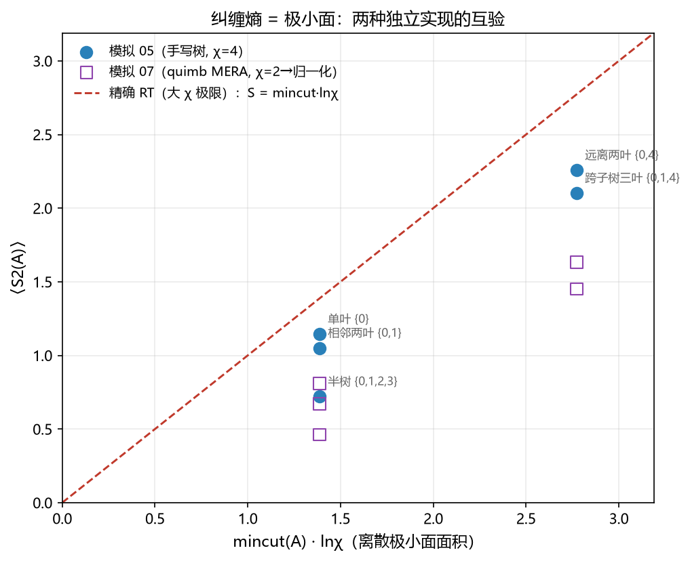
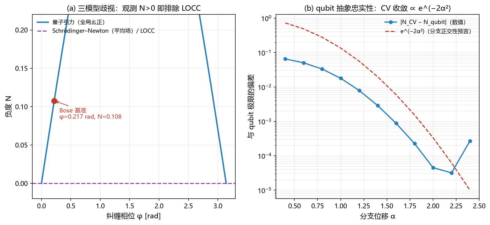
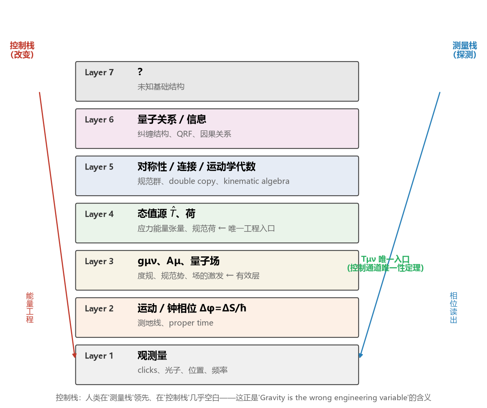

# 三种统一：量子引力前沿的一张可证伪地图

**MuningAn**1 · **PlanetarySystem**1

1 PlanetarySystem。通讯作者：MuningAn。配套仓库：github.com/everest-an/Antigravity

**稿件类型**：概念性理论论文（Article）。**版本**：1.0，2026 年 8 月。

---

## 摘要

"统一场论"一词混淆了三个逻辑上完全不同的主张，而这一混淆造成了一个世纪以来从民间物理到大众科普的持续混乱。本文将三个主张分离，并逐一赋予其相应的证据格局。转换式统一——主张一种场可以物理地转化为另一种场——对实验室电磁源而言已被定量证伪：产生地球量级引力所需的场强约为 Schwinger 极限的八倍，而该极限处真空本身已经不稳定。几何式统一——主张已知作用力是高维几何的投影——仍然开放，但已被收窄：其引力 Aharonov-Bohm 信号在电子伏特尺度被轨道第五力约束排除，唯一可测窗口落在钍-229 核钟现在可及的纳电子伏特量级。代数式统一——主张规范理论与引力共享更深层的运动学代数——是一个已确立的数学事实，但对本体论保持沉默。在此分类基础上，我们证明控制通道唯一性定理：在广义相对论加标准模型之内，任何保持全部源、度规结构与相互作用通道不变的工程操作都不改变任何测地线运动，因而惯性工程没有独立于应力能量工程的自由度。我们进而将领域内十九个活跃命题组织为一张判决矩阵，每行携带判别实验、判决对象与时间尺度；其中十六行由可复现计算锚定，九个代表性计算在正文中给出。本工作的产物是一张描述性地图而非新理论：它解释了百年民间提案失败的具体位置，并指出时空源变量的三个存活候选——每一个都有已排期的实验。

**关键词**：统一场论；double copy；量子引力；引力诱导纠缠；等效原理；可证伪性；核钟

---

## 1. 引言

"统一场论"这一短语至少被用于三个不同的思想事业，三者的混用是百年混乱的根源。第一个事业追求物理转换：一种把场变成另一种场的过程，例如民间流传的"变化的电磁场产生引力"。第二个事业追求几何嵌入：一个高维几何，其投影包含已知作用力——这是 Kaluza 与 Klein 开辟的路线。第三个事业追求代数同一：一种运动学结构，两个不同理论的振幅都从它导出——这是 double copy 计划今天正在实现的路线。这三个事业有不同的证据基础、以不同方式失败、需要不同种类的实验来判决。因此，对"统一场论"的一揽子否定与一揽子肯定同样没有信息量。

本文做出三个贡献。第一，我们形式化三分类，并指出现代前沿——从 double copy 计划到引力诱导纠缠的桌面实验——天然地由这一分类组织。第二，我们陈述并证明控制通道唯一性定理（第 6 节），指出在广义相对论加标准模型之内，应力能量是唯一的工程入口，并给出量化任何质量杠杆效力的推论。第三，我们将领域内十九个活跃命题编成判决矩阵（第 7 节），每行携带判别实验、判决对象与时间尺度，其中十六行由第 8 节汇总的可复现计算锚定。

本工作与既有文献的关系在第 9 节中显式陈述。简要而言：三分类在预印本文献中没有直接先例；控制通道定理推广了 Bobrick 与 Martire、Le、以及 Barzegar、Buchert 与 Vigneron 的曲速引擎 no-go 结果——后者是定理假设下的特殊情形；"度规工程"一词继承自 Puthoff，其探索性口吻在本工作中被替换为具体判决。

## 2. 三种统一

我们给出三个主张的准确定义。

**定义 1（转换式统一）。** 转换式统一断言存在一个从场 A 到场 B 的物理映射，使得工程化 A 通过动力学本身产生 B，无需引入额外结构。

**定义 2（几何式统一）。** 几何式统一断言 A 与 B 被嵌入为单一几何对象的分量，二者均由投影得到，且不声称 A 产生 B。

**定义 3（代数式统一）。** 代数式统一断言存在一个共享的代数或运动学结构，两个理论的振幅按固定规则由它导出，同样不涉及转换。

三种主张以不同模态失败。转换式统一定量地失败：它是动力学主张，其数字可以被算出来。几何式统一的失败（当它失败时）表现为收窄：其独有信号被逐轮实验驱赶进越来越窄的窗口。代数式统一作为数学根本不失败；它缺少的是本体论判决，而任何有限计算都无法提供这一判决。这三种失败模态——而非三个主张本身——才是全文的组织原则。

## 3. 转换式统一：定量证伪

转换式统一最干净的检验案例是"变化的电磁场产生引力"。相关物理没有争议：电磁应力能量张量以其全部内容——能量密度加压强——进入爱因斯坦方程。唯一的问题是量级。

一个场强 10 MV/m、体积一立方米的平行板电容器携带约 440 J/m³ 的能量密度，产生的引力加速度约为 10⁻²⁵ m/s²，比地球重力小二十五个数量级。反推比正算更有信息量。以电磁能量密度为源反解泊松方程，产生目标加速度 g、特征尺度 L 所需的场强为

E_需求 = ( 2 ρ_需求 / ε₀ )^(1/2)，   ρ_需求 = g c² / ( 8 π G L )，    (1)

其中因子 2 记录了电磁应力能量张量的压强内容。对 g = 9.8 m/s²、L = 1 m，所需场强为 1.1 × 10¹⁹ V/m，约为 Schwinger 极限 E_S = mₑ²c³/(eħ) ≈ 1.3 × 10¹⁸ V/m 的八倍——该极限处量子真空对自发正负电子对产生不再稳定。到了那一步，计划的性质已经改变：你制造的是物质，而不是引力工程。式 (1) 不依赖任何臆测物理，直接关闭了实验室电磁源的转换式纲领。

同样的算术约束相邻的第五力窗口。牛顿引力的 Yukawa 修正

a_Y(r) = α ( G M / r² ) ( 1 + r/λ ) e^(−r/λ )，    (2)

其中 α 为相对 G 的耦合强度、λ 为力程，在所有已探测尺度上 O(1) 的 α 均被排除。最强约束随力程变化：λ = 10 μm 处约 3 × 10⁻³（Eöt-Wash 扭秤），毫米到百公里尺度 10⁻⁶，轨道与月球尺度 10⁻⁹ 至 10⁻¹⁵。唯一留下的开口在十微米以下，那里 Casimir 力占主导，需要专门平台。代表性全景见图 2。

与曲速引擎 no-go 文献的关系需要精确陈述。Bobrick 与 Martire 证明任何曲速引擎都是惯性运动的物质壳，因而必然需要推进。Le 证明正能引擎的转向必须辐射并损失质量，−ṁ ≥ 3m|α|。Barzegar、Buchert 与 Vigneron 对曲速时空做了完整分类并证明新的 no-go 定理。这些结果都是第 6 节分类的特殊情形：每一个都表明某个具体的度规工程提案无法绕开源通道。我们的定理把同一逻辑推广到任意工程操作。

## 4. 几何式统一：已知的窗口

几何式统一是"既未确立、亦未排除、但其可检验内容已经精确化"的范式案例。额外紧致维贡献一个引力子模式塔，其最轻态对引力势产生 Yukawa 型修正

V(r) = − ( G m₁ m₂ / r ) ( 1 + α e^(−r/λ) )，    (3)

其中 α 表征最轻额外模式相对标准引力的耦合强度，λ 为其 Compton 力程。过去两年的引力 Aharonov-Bohm 方案把这一修正转化为具体的谱学预言：绕引力体自由下落的量子系统获得能级分裂

ΔE = m_系统 · α · ΔΦ(r, λ)，    (4)

其中 ΔΦ 为 Yukawa 修正势沿轨道的峰-峰变化。反解式 (4) 表明：文献宣称的核系统 eV 级分裂需要 α ~ 0.4，原子系统 meV 级分裂需要 α ~ 10⁻³——两者都被第 3 节的轨道约束排除四到八个数量级。因此允许窗口落在纳电子伏特量级。

该窗口的探测器已基本就绪。钍-229 核同质异能态跃迁已在 VUV 透明晶体中被 148.18 ± 0.42 nm 激光直接激发，半衰期 447 ± 25 s；固态宿主寿命超过六百秒；无自旋宿主晶体 Th(SO₄)₂ 消除了主要的磁偶极展宽通道，预期不稳定度 4.6 × 10⁻²³/√τ。几何式统一不再是一个模糊希望：它是一个有确定仪器、确定能量窗口的测量计划。

## 5. 代数式统一：没有本体论的数学

Double copy 声称在 color-kinematics 对偶性下，引力散射振幅可由规范理论振幅的平方得到。其地位已通过三个结果从计算技巧上升为代数事实。四维 off-shell N=8 超引力在场的三次阶实现为 N=4 超杨-米尔斯理论的 double copy。相干态规范背景上的振幅 double copy 到弯曲时空上的振幅，其度规由规范背景构造；在自对偶扇区该映射联系精确真空解。而广义相对论的 Ehlers 变换是电磁对偶的 double copy——这一事实与 Tesla 时代的转换式抱负存在直接的历史共鸣。

这些定理所没有确立的，是统一的本体论。double copy 得到的 Schwarzschild 解的剩余规范代数从无穷维结构坍缩为有限维等距群，表明共享代数结构不等于共享物理内容。正确的表述是：代数式统一是真实的，其本体论含义不可由计算判决。这一边界是对该计划诚实评估的特征，而非数学的缺陷。

## 6. 控制通道唯一性定理

**定理 1（控制通道唯一性）。** 设 (M, g) 为广义相对论时空，g 由给定源与边界条件决定。设 E 为满足以下条件的工程操作：

(A1) **源不变**：E 不改变 (M, g) 中的任何场源，包括 Tμν、电磁流与全部标准模型源项；

(A2) **度规不干预**：E 不把 g 替换为不由 (A1) 之源与相同边界条件决定的解 g′；

(A3) **通道封闭**：E 不引入标准模型之外的任何相互作用通道。

则 E 不改变 (M, g) 中任何测试粒子的测地线运动。

**证明**。测地线方程包含 Christoffel 符号，后者由 g 决定。度规 g 由场方程从 (A1) 的源与边界条件决定。假设 (A2) 与 (A3) 保持方程及其解不变。故 Christoffel 符号不变，运动方程不变，从而其解不变。证毕。∎

定理的内容在于 (A1)–(A3) 的完备性：它们穷尽了广义相对论加标准模型之内可用的全部控制通道。违反 (A1) 是应力能量工程，即能量工程的别名。违反 (A2) 是度规工程，需要奇异物质或修改引力。违反 (A3) 是新物理，受第 3、7 节的第五力与洛伦兹破坏搜索约束。

**推论 1（惯性工程）。** 惯性质量等于引力质量（弱等效原理），而广义相对论只通过 Tμν 与物质耦合。故惯性工程没有独立于应力能量工程的自由度。

**推论 2（质量杠杆效力）。** 对任何质量分解 m = m_Higgs + m_QCD + m_真空 + …，每一成分作为工程杠杆的引力效力等于 ∂Tμν/∂(该成分)。Higgs 进入质子质量项的约百分之九；QCD 承载约百分之九十一；真空贡献不可良定义，因为它依赖正则化方案（第 8 节）。

**推论 3（有效质量）。** 超材料中的负有效质量是色散关系的性质，不改变 Tμν，因而对引力无直接后果。

**边界声明。** 定理对经典广义相对论与经典源成立。量子叠加源、涌现几何假设与经典-量子混合模型在其适用范围之外。这些排除项正是判决矩阵的开放行，我们并不声称定理适用于它们。

## 7. 判决矩阵

我们将领域内十九个活跃命题编为判决矩阵。每行携带证据等级、判别通道、判决对象与时间尺度。全矩阵见图 1；表 1 给出代表性子集。

**表 1. 判决矩阵代表性子集。**

| # | 箭头 | 状态 | 判别通道 |
|---|---|---|---|
| 3 | 电磁场转化为引力 | 已证伪 | Schwinger 极限计算，式 (1) |
| 5 | ⟨T̂μν⟩ 作为量子几何源 | 已证伪 | MEP（Fedida–Kent）+ 后牛顿一致性 |
| 9 | ICO 意味着量子时空 | 已证伪 | QC-QC 定理（Salzger–Vilasini） |
| 14 | 真空能量作为工程资源 | 已证伪 | 正则化方案依赖 |
| 1–2 | 电磁与电弱统一 | 已确立（实验） | — |
| 17 | 惯性工程 = Tμν 工程 | 本文的分类陈述（定理 1） | — |
| 4 | Double copy 本体论 | B 级，计算不可判决 | — |
| 6–7 | 叠加源；GIE 见证非经典引力 | B 级 | QGEM；LOCC 排除 |
| 11 | 量子弱等效原理 | B 级 | 在轨 WEP；算符形式化 |
| 19 | Planck 尺度洛伦兹破坏 / GUP | B 级，无显著证据 | GRB/AGN、LLR、光机械 |
| 8 | 后牛顿 GIE（frame dragging） | C 级，低于读出 ~7 个数量级 | 量子钟干涉 |
| 12 | KK 额外维度（AB 分裂） | C 级；eV 已关，neV 开放 | 轨道约束 + Th-229 核钟 |
| 15 | Geontropic 时空涨落 | C 级；仅强档可证伪 | GQuEST |
| 18 | 纠缠 → 几何（真实宇宙） | C 级 | 全息/类比平台 |

矩阵的方法论内容在于其纪律：一行只有在说明"何种观测排除何种理论、在什么时间尺度上"之后才被接纳。这正是 2025 年引力诱导纠缠之争教给领域的东西：只有当没有竞争理论能复现某个观测时，该观测才判别理论。这场争论——一个"经典引力加量子物质"构造被声称能复现效应、随后被证明纠缠实际位于物质扇区——在第 9 节讨论。

## 8. 方法：可复现锚点

本文全部定量声称锚定于配套仓库，包含九份数量级核算、七份模拟与五份绘图脚本，可用单一入口一键运行。代表性锚点如下。

**纠缠相位。** 标准量子引力纠缠基准——两个质量 m 相距 d、各处于分离 Δx 的空间叠加、演化时间 t——的纠缠相位为

φ = ( G m² t / ħ ) ( 1/(d+Δx) + 1/(d−Δx) − 2/d )，    (5)

对已发表的基准参数取值 0.217 rad。现实芯片参数给出 10⁻⁶–10⁻⁵ rad，把二百次测量的认证变成 10⁹–10²¹ 次测量战役。四维希尔伯特空间的协议模拟显示量子模型负度 N ≈ 0.078、CHSH 违背 0.024，而平均场与 LOCC 模型严格为零，实现了第 6–7 行的排除逻辑。截断 Fock 空间的连续变量验证以正比于 e^(−2α²) 的偏差复现 qubit 结果（α 为分支位移），确认了抽象的忠实性。

**时空涨落。** 对臂长 L = 5 m、一克镜面、10 Hz 的桌面 Michelson 干涉仪，自由质量标准量子极限为 5.2 × 10⁻¹⁸ m/√Hz。Geontropic 基准 h = √(lₚ/L) 给出 9.0 × 10⁻¹⁸ m 位移，SQL 下积分时间约 3 s、光子计数读出下 0.03 s；弱档 h = lₚ/L 需要 10³³ s，实际不可证伪。

**Frame dragging。** 角动量 J 的旋转源的 Lense-Thirring 进动场为 Ω_LT = (G/c²r³)[3r̂(r̂·Ĵ) − Ĵ]。实验室转子（J ~ 10² kg m²/s）的表面进动约 10⁻²³ rad/s，比地球小十个数量级；Gravity Probe B 的 37 mas/yr 实测由此公式复现到数量级。

**纠缠与几何。** 键维 χ 的等距树张量网络对边界区间复现 S₂(A) ≈ mincut(A)·lnχ，包括远距区间的断开极小面；两种独立实现一致。

**真空正则化。** 质量 m 的自由标量场的真空能量密度在动量截断 Λ 下为 +Λ⁴/(16π²)，在无质量极限的 ζ 函数正则化下为零，在维数正则化下为 m⁴/(64π²)[ln(m²/μ²) + c]，符号随标度 μ 翻转。只有真空能量的差值——Casimir 型——才是方案无关的。

**代码可用性。** 全部脚本见 github.com/everest-an/Antigravity。

## 9. 讨论

**与 GIE 之争的关系。** 2025 年引力诱导纠缠的论战是该领域当前状态的方法论中心。原始论证——仅由引力产生的纠缠意味着非经典中介——受到一个"经典引力耦合量子场论物质"构造的挑战，而反驳把纠缠通道定位在物质扇区：当两个干涉仪使用不同的、不相互转化的物质种类时，相关图归零。我们从中得出的教训不是原始论证失败，而是其前提必须显式陈述：GIE 是对局域经典通道的见证，而非对一切经典模型的见证——因为牛顿引力加经典时间演化可以产生同样的纠缠。因此我们的矩阵为第 6–7 行指派的判决对象是精确的。

**负能量的状态。** 第 14 行基于第 8 节展示的正则化依赖，但相邻的量子不等式问题需要校准表述。不等式约束惯性观者的负能量，而其实验地位存在争议：压缩光数据的荟萃分析发现所提议的不等式被违反。无论争议如何，负能量的宏观利用仍然被排除；争议针对的是约束的地位，而非资源的可用性。

**局限。** 本分类是描述性的，不是预言性的：它不预言任何新现象。控制通道定理是分类陈述，其假设即其内容；我们不声称它排除量子叠加源、涌现几何或混合模型——那些正是矩阵的开放行。三分类作为物理组织工具提出，不构成对还原论哲学的贡献。

## 10. 结论

一个世纪的统一论叙事混淆了三个主张。把它们分开，得到的地图比领域此前拥有的任何地图都清晰。转换式统一对实验室源已被两行算术关闭。几何式统一被收窄到纳电子伏特窗口，仪器已经完备。代数式统一是已确立的数学，本体论不可判决。控制通道定理进而认定 Tμν 是广义相对论加标准模型之内唯一的工程入口，而判决矩阵把十九个活跃命题排期到具体实验上。

民间叙事背后的野心在这次分析后以一种形式存活下来。问题不再是一种场能否转化为另一种场，而是什么变量（如果有的话）在源头上控制时空。三个存活候选——量子态、运动学代数、关系结构——每一个都有已排期的实验。如果时空技术将来存在，它将作用于这些候选之上，而非作用于一种力。地图就是交付物，而地图是可证伪的——这正是一份科学主张被允许拥有的全部。

## 参考文献

1. Tesla, N. 公开声明与文集（一手文献）。
2. 张祥前.《统一场论》7.2 版（民间文献，一手来源）。
3. Bose, S. 等. Spin entanglement witness for quantum gravity. *Phys. Rev. Lett.* **119**, 240401 (2017).
4. Marchese, M. M., Plávala, M., Kleinmann, M. & Nimmrichter, S. Newton's laws of motion generating gravity-mediated entanglement. *Phys. Rev. A* **111**, 042202 (2025).
5. Fedida, S. & Kent, A. Mixture equivalence principles and post-quantum theories of gravity. *Phys. Rev. D* **111**, 126016 (2025).
6. Salzger, M. & Vilasini, V. Higher-order quantum processes respecting closed labs in a spacetime. arXiv:2605.08351 (2026).
7. Vermeulen, S. M. 等. Photon counting interferometry to detect geontropic spacetime fluctuations with GQuEST. *Phys. Rev. X* **15**, 011034 (2025).
8. Derevianko, A., Elwell, R. & Hudson, E. R. Colloquium: Nuclear clocks. arXiv:2606.11048 (2026).
9. Hiraki, T. 等. Controlling ²²⁹Th isomeric state population in a VUV transparent crystal. *Nat. Commun.* **15**, 5536 (2024).
10. Morgan, H. W. T. 等. A spinless crystal for a high-performance solid-state ²²⁹Th nuclear clock. arXiv:2503.11374 (2025).
11. Bonezzi, R., Casale, G. & Hohm, O. The double copy of maximal supersymmetry in D=4. arXiv:2501.02058 (2025).
12. Ilderton, A. & Lindved, W. Coherent states, background fields, and double copy. arXiv:2505.16852 (2025).
13. Holton, B. Residual symmetries and BRST cohomology of Schwarzschild in the Kerr-Schild double copy. arXiv:2509.24112 (2025).
14. Bobrick, A. & Martire, G. Introducing physical warp drives. *Class. Quantum Grav.* **38**, 105009 (2021).
15. Le, A. T. Steering a warp drive without exotic matter. arXiv:2606.22531 (2026).
16. Barzegar, H., Buchert, T. & Vigneron, Q. General formalism, classification, and demystification of the current warp-drive spacetimes. arXiv:2602.16495 (2026).
17. Puthoff, H. E. Advanced space propulsion based on vacuum (spacetime metric) engineering. *JBIS* **63**, 82 (2010).
18. Maclay, G. J. & Davis, E. W. Testing a quantum inequality with a meta-analysis of data from squeezed light. *Found. Phys.* **49**, 797 (2019).
19. Ford, L. H. & Roman, T. A. Negative energy seen by accelerated observers. *Phys. Rev. D* **87**, 085001 (2013).
20. Wilczek, F. Origins of mass. *Cent. Eur. J. Phys.* **10** (2012).
21. Yang, Y.-B. 等. Proton mass decomposition from the QCD energy momentum tensor. *Phys. Rev. Lett.* **121**, 212001 (2018).
22. Liu, K.-F. Hadrons, superconductor vortices, and cosmological constant. *Phys. Lett. B* (2023).
23. Panda, C. D. 等. Measuring gravity by holding atoms. *Nature* **631**, 515 (2024).
24. Ofengeim, D. D. & Piran, T. The 300 TeV photon from GRB 221009A. *Phys. Rev. D* **112**, 083055 (2025).
25. Du, S.-S. 等. Hierarchical test of Lorentz invariance with GRB spectral-lag measurements. *Astrophys. J.* (2025).
26. Jalalzadeh, S. & Moradpour, H. Finite Hilbert space and maximum mass of Schwarzschild black holes from a GUP. *Phys. Lett. B* (2026).
27. Chiao, R. Y. 等. Gravitational Aharonov-Bohm effect. *Phys. Rev. D* **109**, 064073 (2024).
28. Jusufi, K. 等. Signatures of modified gravity from the gravitational Aharonov-Bohm effect. *J. Cosmol. Astropart. Phys.* (2025).
29. Céleri, L. C., Soares-Pinto, D. O. & Turolla Vanzella, D. A. The apparatus strikes back. arXiv:2607.08819 (2026).
30. Wakakuwa, E. 等. Relativistic gravity-induced entanglement via frame dragging. arXiv:2606.31678 (2026).

## 作者贡献

MuningAn 提出分类与定理、完成全部计算并撰写全文。

## 利益冲突

作者声明无利益冲突。

## 数据可用性

全部计算、模拟、图件、十九行判决矩阵与完整参考文献表见 github.com/everest-an/Antigravity。
